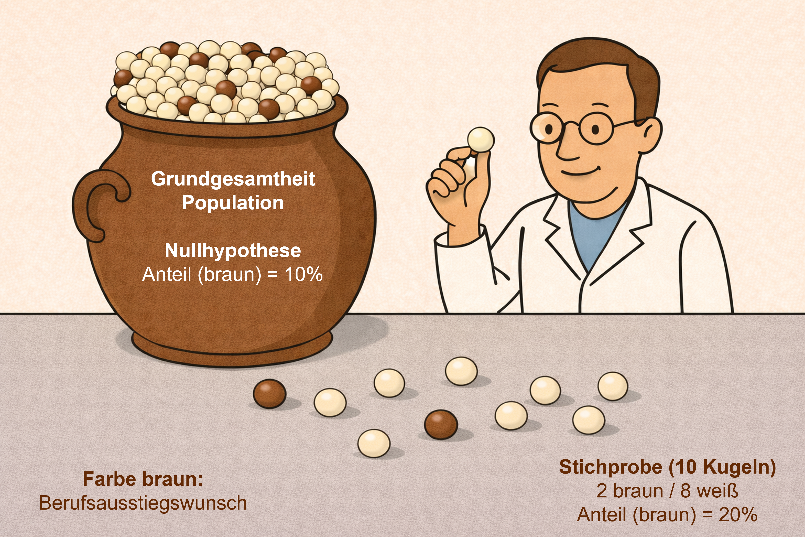
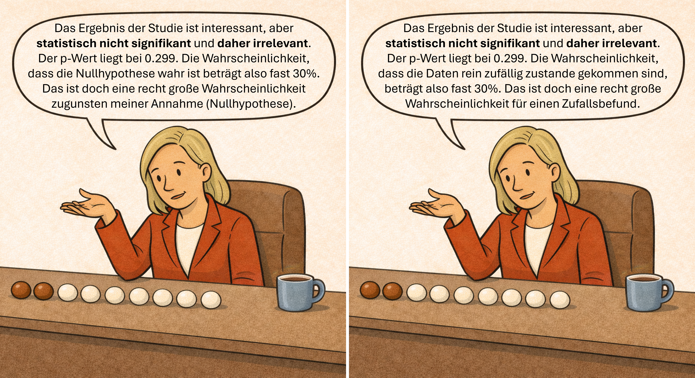

## Synonyme Begrifflichkeiten

- Schließende/schlussfolgernde Statistik
- Schlussfolgerung von der Stichprobe auf die Grundgesamtheit (Population)
- Hypothesenprüfende Statistik (NHST: Nullhypothesen-Signifikanztest)

## Grundbegriffe & Beispiel


Wir wollen die Aussage der Bildungspolitikerin empirisch prüfen (mit einer Studie/Stichprobe untersuchen).

Die Aussage der Bildungspolitikerin ist die sogenannte Nullhypothese.

- **Nullhypothese**: Anteil der Lehrkräfte, die über einen Berufsausstieg nachdenken = 10%

::: {.callout-tip}
## Hinweis zur Nullhypothese
Der Referenzwert der Nullhypothese ist in diesem Falle 10%. In vielen anderen Szenarien der Inferenzstatistik wählt man häufig den Wert Null (0), wenn z.B. kein Zusammenhang (Korrelation von Null) zwischen zwei Merkmalen angenommen wird. Daher hat sich das Präfix „Null“ vor dem Wort „Hypothese“ etabliert.
:::

Die Nullhypothese repräsentiert eine Annahme über die Grundgesamtheit (z.B. alle Lehrkräfte in Deutschland). In diesem Falle ist es eine Annahme der Bildungspolitikerin über die Berufsgedanken der Lehrkräfte in Deutschland. Wir haben gewisse Zweifel an der Aussage der Bildungspolitikerin und vermuten, dass der Anteil der Lehrkräfte mit Berufsausstiegswunsch höher ist. Somit haben wir eine gerichtete Alternativhypothese (Forschungshypothese) zur Nullhypothese formuliert.

- **Nullhypothese**: Anteil der Lehrkräfte, die über einen Berufsausstieg nachdenken = 10%
- **Alternativ-/Forschungshypothese**: Anteil der Lehrkräfte, die über einen Berufsausstieg nachdenken > 10%

Dieses Szenario der Inferenzstatistik wird häufig mit einem **Urnenmodell** veranschaulicht. Die Kugeln in der Urne repräsentieren die Lehrkräfte in Deutschland (Grundgesamtheit). Lehrkräfte mit einem Berufsausstiegswunsch werden durch braune Kugeln (🟤) repräsentiert. Lehrkräfte, die keinen Berufsausstiegswunsch äußern, werden durch weiße Kugeln (⚪) repräsentiert.



Der Anteil der Lehrkräfte mit Berufsausstiegswunsch ist nicht bekannt. Das heißt, der genaue Inhalt der Urne (Grundgesamtheit) ist unbekannt. Die eingefärbten Kugeln in der Urne repräsentieren also nicht die Wirklichkeit, sondern eine Annahme über die Wirklichkeit (Annahme der Nullhypothese): Anteil der Lehrkräfte, die über einen Berufsausstieg nachdenken = 10% (10% der Kugeln sind braun eingefärbt). **Das Urnenmodell ist daher eine Vorstellung über die Wirklichkeit unter der Annahme der Nullhypothese**. Lediglich eine Vollerhebung, also die Befragung aller Lehrkräfte in Deutschland, würde den wahren Inhalt der Urne wiedergeben. Eine Vollerhebung ist in der Regel aber nicht möglich.

Daher realisieren wir in unserer Studie eine Zufallsstichprobe von Lehrkräften und fragen die Lehrkräfte: **„Haben Sie in den letzten 3 Monaten über einen Ausstieg aus dem Lehrerberuf nachgedacht?“** (Antwortoption: ja/nein). Wir konnten 10 Lehrkräfte befragen und erhalten einen Anteil von 20% (Lehrkräfte mit Berufsausstiegswunsch). In der Logik der Urnenmodells haben wir also 2 braune und 8 weiße Kugeln aus der Urne gezogen.

🟤🟤⚪⚪⚪⚪⚪⚪⚪⚪ 20% (Stichprobe)

🟤⚪⚪⚪⚪⚪⚪⚪⚪⚪ 10% (Grundgesamtheit: Annahme der Nullhypothese)

Das Ergebnis der Stichprobe widerspricht der Annahme der Nullhypothese (20% vs. 10%). In der Stichprobe ist der Anteil der Lehrkräfte mit Berufsausstiegswunsch sogar doppelt so hoch (im Vergleich zur Annahme der Nullhypothese). Betrachten wir nun den statistischen Nullhypothesen-Signifikanztest (NHST):

```{r}
# 2 braune Kugeln bei einer Stichprobengröße von 10 (10 Kugeln zufällig aus der Urne gezogen)
# Nullhypothese: p = 0.1 (p steht für proportion, also Anteil)
# alternative = "greater" (Richtung der Alternativ-/Forschungshypothese: p > 0.1)

binom.test(2, 10, p = 0.1, alternative = "greater")
```

Der statistische Nullhypothesen-Signifikanztest offenbart einen p-Wert von 0.299. Dar Ergebnis ist daher statistisch nicht signifikant, gemäß der gängigen Konvention:

- *p* < 0.05 (statistisch signifikant)
- *p* ≥ 0.05 (statistisch nicht signifikant)

Wir präsentieren unser Ergebnis gegenüber der Bildungspolitik und erhalten zwei grundsätzlich falsche Interpretationen des p-Wertes.



 **Der p-Wert ist eine Wahrscheinlichkeit. Der p-Wert kann aber keine Aussage oder Wahrscheinlichkeitsaussage über die Wahrheit oder Falschheit von Hypothesen machen!**

"This is, without a doubt, the most pervasive and pernicious of the many misconceptions about the P value. It perpetuates the **false idea that the data alone can tell us how likely we are to be right or wrong** in our conclusions. The simplest way to see that this is false is to note that the **P value is calculated under the assumption that the null hypothesis is true**. It therefore cannot simultaneously be a probability that the null hypothesis is false."

Wenn 1 von 10 Kugeln braun sind, ist es ein Beweis dafür, dass in der Urne keine oder kaum weiße Kugeln sind? Nein!

Wenn 9 von 10 Kugeln braun sind, ist es ein Beweis dafür, dass in der Urne keine oder kaum weiße Kugeln sind? Nein!

Keine Konstalation der Daten kann etwas über den wahren inhalt der Urne aussagen. 
	
**P-values do not measure the probability that the studied hypothesis is true, or the probability that the data were produced by random chance alone**

"Researchers often wish to turn a p-value into a statement about the truth of a null hypothesis, or about the probability that random chance produced the observed data. The p-value is neither. It is a statement about data in relation to a specified hypothetical explanation, and is not a statement about the explanation itself."

https://www.sciencedirect.com/science/article/pii/S0037196308000620?via%3Dihub

https://www.stat.berkeley.edu/~aldous/Real_World/ASA_statement.pdf

```{r}
library(ggplot2)

# Your test parameters
n <- 10
p_null <- 0.10
observed <- 2

# Perform the test
test_result <- binom.test(observed, n, p = p_null, alternative = "greater")

# Create data for the binomial distribution
x <- 0:n
probs <- dbinom(x, size = n, prob = p_null)

# Create a data frame
df <- data.frame(
  x = x,
  probability = probs,
  in_rejection_region = x >= observed
)

ggplot(df, aes(x = x, y = probability)) +
  geom_col(aes(fill = in_rejection_region), width = 0.7, color = "black") +
  geom_vline(xintercept = observed, color = "#E74C3C", linewidth = 1, linetype = "solid") +
  geom_vline(xintercept = n * p_null, color = "black", linewidth = 1, linetype = "dashed") +
  scale_fill_manual(
    values = c("TRUE" = "#E74C3C", "FALSE" = "#95A5A6"),
    labels = c("TRUE" = paste0("p-Wert-Bereich\n(p = ", round(test_result$p.value, 4), ")")),
    name = NULL,
    breaks = c("TRUE")
  ) +
  scale_x_continuous(breaks = seq(0, n, by = 5)) +
  labs(
    title = paste0("Nullhypothese = ", p_null*100, "% (", n*p_null, ")"),
    subtitle = paste0("Stichprobe = ", round(observed/n*100, 2),"% (", observed, ")"),
    caption = paste0("n = ", n),
    x = "mögliche Stichprobenergebnisse",
    y = "Wahrscheinlichkeit"
  ) +
  theme_minimal(base_size = 12) +
  theme(
    legend.position = "bottom",
    panel.grid.minor = element_blank(),
    plot.subtitle = element_text(color = "#E74C3C", face = "bold")
  )
```

## Interaktive Visualisierung des p-Wertes

```{r}
#| context: setup
#| echo: false
library(shiny)
library(ggplot2)
```

```{r}
#| panel: sidebar
#| echo: false

numericInput("n", "Stichprobengröße (n):", 
             value = 10, min = 1, max = 1000, step = 1)

br()

numericInput("p_null", "Nullhypothese (%):", 
             value = 10, min = 1, max = 99, step = 1)

br()

numericInput("observed", "Stichprobenergebnis:", 
             value = 2, min = 0, max = 1000, step = 1)

br()

actionButton("plot_btn", "Plot erstellen", 
             class = "btn-primary")
```

```{r}
#| panel: fill
#| echo: false

plotOutput("binomPlot")
```

```{r}
#| context: server
#| echo: false

observeEvent(input$plot_btn, {
  output$binomPlot <- renderPlot({
    # Get parameters
    n <- input$n
    p_null <- input$p_null / 100  # Convert percentage to proportion
    observed <- input$observed
    
    # Validate inputs
    req(n > 0, observed >= 0, observed <= n, p_null > 0, p_null < 1)
    
    # Perform the test
    test_result <- binom.test(observed, n, p = p_null, alternative = "greater")
    
    # Create data for the binomial distribution
    x <- 0:n
    probs <- dbinom(x, size = n, prob = p_null)
    
    # Create a data frame
    df <- data.frame(
      x = x,
      probability = probs,
      in_rejection_region = x >= observed
    )
    
    # Create the plot
    ggplot(df, aes(x = x, y = probability)) +
      geom_col(aes(fill = in_rejection_region), width = 0.7, color = "black") +
      geom_vline(xintercept = observed, color = "#E74C3C", linewidth = 1, linetype = "solid") +
      geom_vline(xintercept = n * p_null, color = "black", linewidth = 1, linetype = "dashed") +
      scale_fill_manual(
        values = c("TRUE" = "#E74C3C", "FALSE" = "#95A5A6"),
        labels = c("TRUE" = paste0("p-Wert-Bereich\n(p = ", round(test_result$p.value, 4), ")")),
        breaks = c("TRUE"),
        name = NULL
      ) +
      scale_x_continuous(breaks = seq(0, n, by = 5)) +
      labs(
        title = paste0("Nullhypothese = ", p_null*100, "% (", n*p_null, ")"),
        subtitle = paste0("Stichprobe = ", round(observed/n*100, 2),"% (", observed, ")"),
        caption = paste0("n = ", n),
        x = "mögliche Stichprobenergebnisse",
        y = "Wahrscheinlichkeit"
      ) +
      theme_minimal(base_size = 12) +
      theme(
        legend.position = "bottom",
        panel.grid.minor = element_blank(),
        plot.subtitle = element_text(color = "#E74C3C", face = "bold")
      )
  })
})
```